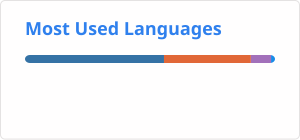

Hello there
-----------------------------

#### Lanugages

#### ML/AI

\

\

#### Systems/Tools

\

#### Learning/Having Fun

\

<picture>
  <source media="(prefers-color-scheme: dark)" srcset="profile/top-langs-dark.svg" />
  
</picture>

      
